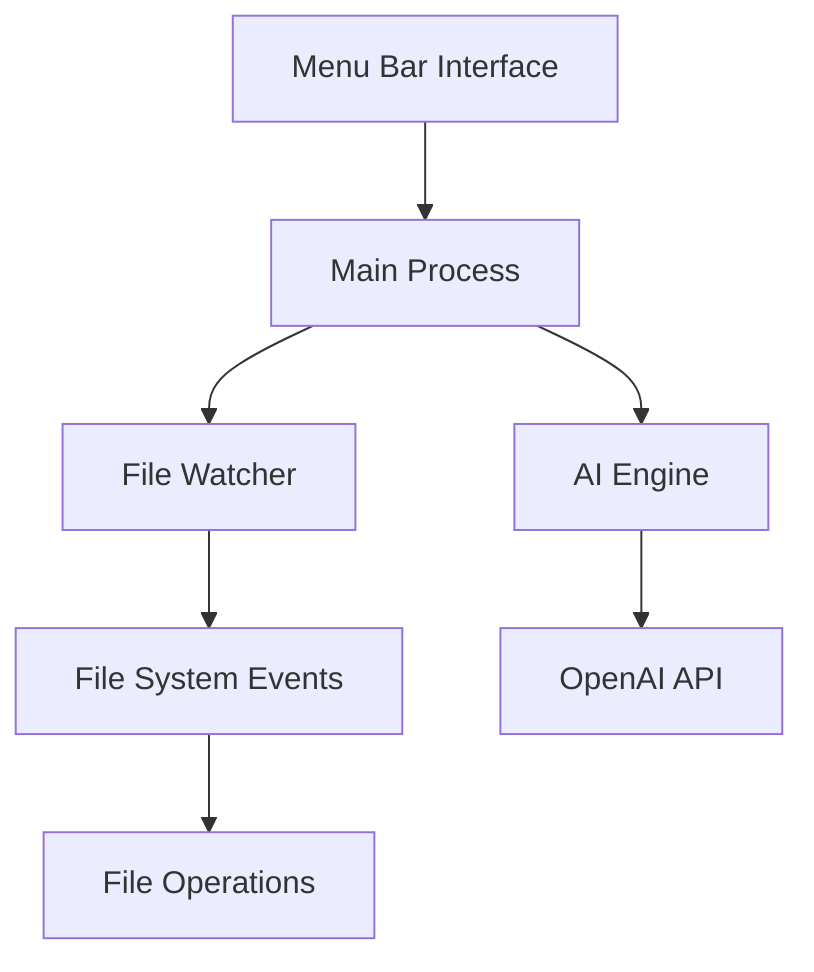

# Technical Documentation

## Architecture Overview

### Core Components

1. **File System Monitor**
   - Watches desktop directory for changes
   - Handles file creation, modification, deletion events
   - Implements debouncing for performance
   - Uses chokidar for file system events

2. **AI Engine**
   - Integrates with OpenAI GPT API
   - Manages system prompts
   - Handles file categorization
   - Implements caching for performance

3. **Menu Bar Interface**
   - System tray integration
   - Status display
   - Control options
   - Settings management

### System Architecture



## Implementation Details

### 1. File System Monitoring

```javascript
// src/main/fileWatcher.js
const chokidar = require('chokidar');

class FileWatcher {
  constructor() {
    this.watcher = chokidar.watch(DESKTOP_PATH, {
      ignored: /(^|[\/\\])\../,
      persistent: true
    });
    
    this.watcher
      .on('add', path => this.handleNewFile(path))
      .on('unlink', path => this.handleDeletedFile(path));
  }
  
  handleNewFile(path) {
    // Process new file
  }
}
```

### 2. AI Integration

```python
# python/organizer/classifier.py
class AIClassifier:
    def __init__(self, api_key):
        self.client = OpenAI(api_key=api_key)
        self.cache = {}
        
    async def classify_file(self, filename):
        if filename in self.cache:
            return self.cache[filename]
            
        response = await self.client.chat.completions.create(
            model="gpt-4",
            messages=[
                {"role": "system", "content": CLASSIFICATION_PROMPT},
                {"role": "user", "content": filename}
            ]
        )
        
        category = response.choices[0].message.content
        self.cache[filename] = category
        return category
```

### 3. Menu Bar Implementation

```javascript
// src/main/menuBar.js
class MenuBar {
  constructor() {
    this.tray = new Tray(ICON_PATH);
    this.menu = Menu.buildFromTemplate([
      { label: 'Start Organizer', click: () => this.startOrganizer() },
      { label: 'Stop Organizer', click: () => this.stopOrganizer() },
      { type: 'separator' },
      { label: 'Settings', click: () => this.showSettings() },
      { label: 'Quit', click: () => app.quit() }
    ]);
    this.tray.setContextMenu(this.menu);
  }
}
```

## AI System Prompts

### 1. Initial Categorization Prompt
```plaintext
You are an expert file organizer. Analyze the following file names and suggest
appropriate categories. Rules:
1. Maximum 10 categories
2. Use broad categorization
3. Consider file name patterns
4. Return JSON format
```

### 2. File Classification Prompt
```plaintext
Given a file name and existing categories, determine the most appropriate category.
Consider:
1. File name patterns
2. Common naming conventions
3. Likely file contents
4. Return single category name
```

### 3. New Category Suggestion Prompt
```plaintext
Analyze uncategorized files and suggest new categories if needed. Rules:
1. Maintain existing categories
2. Suggest new only if necessary
3. Keep total under 10 categories
4. Return JSON format
```

## File Organization Logic

### Category Management
```javascript
class CategoryManager {
  constructor() {
    this.categories = new Map();
    this.maxCategories = 10;
  }

  async suggestCategory(filename) {
    const existingCategory = this.findMatchingCategory(filename);
    if (existingCategory) return existingCategory;
    
    return await this.aiClassifier.suggestNewCategory(filename);
  }
}
```

### File Operations
```javascript
class FileOperations {
  async moveFile(source, category) {
    const targetDir = path.join(ORGANIZED_DIR, category);
    await fs.ensureDir(targetDir);
    
    const newName = this.formatFileName(path.basename(source));
    const target = path.join(targetDir, newName);
    
    await fs.move(source, target, { overwrite: false });
  }
  
  formatFileName(name) {
    const date = moment().format('YYYYMMDD');
    return `${date}_${name}`;
  }
}
```

## Performance Optimizations

1. **File Watching**
   - Debounce file system events
   - Ignore temporary files
   - Batch processing

2. **AI Requests**
   - Cache classification results
   - Batch classification requests
   - Rate limiting

3. **File Operations**
   - Asynchronous operations
   - Batch file moves
   - Progress tracking

## Error Handling

```javascript
class ErrorHandler {
  static async handleFileError(error, file) {
    logger.error(`File operation failed: ${error.message}`, {
      file,
      error: error.stack
    });
    
    await this.notifyUser({
      title: 'File Error',
      message: `Failed to process ${path.basename(file)}`
    });
  }
}
```

## Logging System

```javascript
const winston = require('winston');

const logger = winston.createLogger({
  level: 'info',
  format: winston.format.json(),
  transports: [
    new winston.transports.File({ filename: 'error.log', level: 'error' }),
    new winston.transports.File({ filename: 'combined.log' })
  ]
});
```

## Configuration Management

```javascript
class Config {
  static async load() {
    return await fs.readJSON(CONFIG_PATH);
  }
  
  static async save(config) {
    await fs.writeJSON(CONFIG_PATH, config, { spaces: 2 });
  }
}
```

## Testing Strategy

### Unit Tests
```javascript
describe('CategoryManager', () => {
  test('suggests appropriate category for file', async () => {
    const manager = new CategoryManager();
    const category = await manager.suggestCategory('document.pdf');
    expect(category).toBe('Documents');
  });
});
```

### Integration Tests
```python
def test_file_organization():
    organizer = FileOrganizer()
    test_file = create_test_file()
    
    organizer.process_file(test_file)
    assert file_in_correct_category(test_file)
```

## Security Considerations

1. **File Operations**
   - Sanitize file names
   - Handle permissions
   - Prevent path traversal

2. **API Security**
   - Secure API key storage
   - Rate limiting
   - Error handling

3. **User Data**
   - Local storage only
   - No external transmission
   - Secure configuration

## Future Improvements

1. **Performance**
   - Parallel processing
   - Better caching
   - Reduced API calls

2. **Features**
   - Custom categories
   - Content analysis
   - Undo/redo

3. **UI/UX**
   - Better status display
   - Progress indicators
   - Custom notifications
